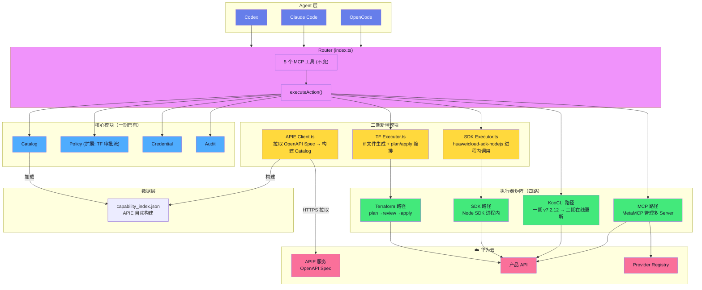
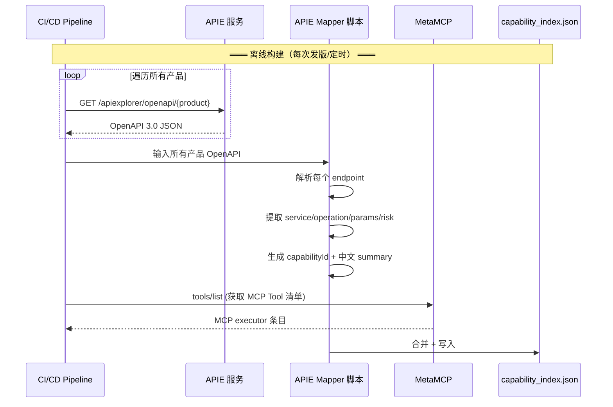
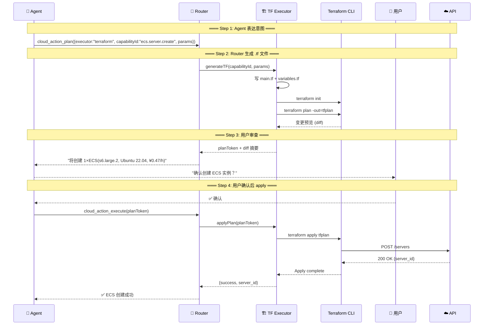

# huaweicloud-mate 二期架构 — 集成 APIE + SDK + Terraform

> 状态：Proposed v2.0  
> 日期：2026-07-16  
> 基线：一期 v1.2 代码 (`/home/developer/Desktop/huaweicloud-mate/`)

---

## 一、一期 vs 二期对比

```
                    一期 v1.2              二期 v2.0
                    ────────               ───────
MCP                 ✅ spawn stdio         ✅ + MetaMCP 管理
KooCLI              ✅ spawn CLI           ✅ + KooCLI 在线更新
APIE                ⚠️ 离线手工扫描         ✅ 在线 APIE 拉取 + 自动构建 Catalog
SDK                 ❌                     ✅ 进程内调用 (Node SDK)
Terraform           ❌                     ✅ plan→review→apply 工作流
Catalog 数据源       KooCLI --help           APIE OpenAPI (参数完整)
MetaMCP             ⏳ 评估中               ✅ metatool-ai/metamcp
```

---

## 二、二期总架构



---

## 三、APIE 集成

### 问题

一期用 `hcloud --help` 扫描生成 Catalog，缺陷：
- 参数只有 `required: ["region"]`，缺少真实的 required/optional/defaults
- 没有参数类型（string/integer/enum）
- 没有参数描述

### 方案

````
APIE OpenAPI Spec                     capability_index.json
─────────────────                     ─────────────────────
GET /v2.1/{project_id}/servers        huaweicloud.ecs.server.list.v1
  parameters:                           executors.koocli.params:
    - name: project_id                    required: ["project_id"]
      required: true                      optional: ["status","limit","name","tags"]
    - name: status                        defaults: {"limit": 50}
      required: false                     
      enum: [ACTIVE, STOPPED, ERROR]    risk: read
    - name: limit                       summary: "查询ECS实例列表。支持按状态过滤。"
      required: false
      default: 50
      type: integer

### 数据流



### 代码接口

```typescript
// src/router/apie-client.ts (二期新增)

interface APIEClient {
  /** 拉取指定产品的 OpenAPI Spec */
  fetchOpenAPI(product: string): Promise<OpenAPISpec>;
  
  /** 构建全量 capability_index.json */
  buildCatalog(): Promise<CapabilityIndex>;
}

class APIECatalogBuilder implements APIEClient {
  private baseUrl = "https://console.huaweicloud.com/apiexplorer/openapi";

  async fetchOpenAPI(product: string): Promise<OpenAPISpec> {
    // HTTP GET → JSON parse → validate
  }

  async buildCatalog(): Promise<CapabilityIndex> {
    // 1. 遍历所有产品 → fetchOpenAPI
    // 2. 每个 endpoint → capability entry
    //    - 参数: 从 OpenAPI parameters 提取 required/optional/defaults/type/enum
    //    - 风险: 从 method(GET→read/POST→cost/DELETE→destructive) + tags 推断
    //    - summary: 从 OpenAPI description 提取
    // 3. 合并 MetaMCP tools/list → MCP executor 条目
    // 4. 构建 search_index
  }
}
```

### 决策点

#### A1：APIE 拉取时机

APIE OpenAPI Spec 是动态变化的（产品部新增/修改接口），Catalog 需要定期刷新。

| 选项 | 做法 | 优点 | 缺点 |
|------|------|------|------|
| **A：离线构建** | CI 构建时拉取 APIE，打包进插件。用户安装后 Catalog 固定 | 零网络依赖；启动快 | Catalog 过期（可能几周前的数据） |
| **B：在线拉取** | Router 每次启动时从 APIE 实时拉取全量 OpenAPI | Catalog 始终最新 | 启动慢（需拉取 210 个产品）；依赖 APIE 可用性 |
| **C：混合模式** | 打包自带一份离线 Catalog + 启动时后台异步刷新 + 本地缓存 24h | 兼顾可用性和时效性 | 实现复杂 |

> **建议 C**：插件自带离线 Catalog（不联网也能用），后台异步刷新。对齐一期 KooCLI 自动安装的思路。

#### A2：APIE 认证方式

APIE 的 OpenAPI 导出接口目前是通过控制台登录后访问。API 接口是否需要认证？

| 选项 | 做法 | 优点 | 缺点 |
|------|------|------|------|
| **A：控制台 Cookie** | 需要用户先在浏览器登录，导出 Cookie | 无需额外权限 | Cookie 过期频繁；自动化差 |
| **B：IAM Token** | 使用 AK/SK 换取 IAM Token，携带 Token 访问 APIE | 与现有凭证体系一致 | 需要 APIE 支持 IAM 认证 |
| **C：公开接口** | 确认 APIE 是否已有无需认证的公网 OpenAPI 导出接口 | 最简单 | 取决于 APIE 团队是否支持 |

> **建议**：先确认 APIE 团队是否提供公开/Token 认证的 API 接口。如没有，首版继续用 KooCLI 离线扫描（一期方式），APIE 自动拉取作为二期目标。

---

## 四、SDK 集成

### 方案

```
executor="mcp"          executor="koocli"       executor="sdk" (二期新增)
─────────────           ──────────────           ──────────────────
spawn MCP 子进程         spawn hcloud 子进程     进程内 require/import
stdio JSON-RPC           stdin/stdout           函数调用
~50ms 启动开销           ~50ms 启动开销           0ms 启动开销
产品部维护 MCP Server    KooCLI 团队维护          SDK 团队维护
```

### 代码接口

```typescript
// src/router/sdk-executor.ts (二期新增)

import { EcsClient } from "@huaweicloud/huaweicloud-sdk-ecs";
import { ObsClient } from "@huaweicloud/huaweicloud-sdk-obs";

class SDKExecutor {
  private clients: Map<string, any> = new Map();

  /** 按需初始化 SDK Client（连接池） */
  getClient(service: string, credentials: CredentialConfig): any {
    const key = `${service}-${credentials.huaweicloud_region}`;
    if (!this.clients.has(key)) {
      const ClientClass = SDK_CLASS_MAP[service];
      this.clients.set(key, new ClientClass({
        accessKeyId: credentials.huaweicloud_access_key,
        secretAccessKey: credentials.huaweicloud_secret_key,
        region: credentials.huaweicloud_region,
      }));
    }
    return this.clients.get(key);
  }

  /** 执行 SDK 调用 */
  async execute(
    service: string,
    operation: string,
    params: Record<string, any>,
    credentials: CredentialConfig
  ): Promise<ExecutionResult> {
    const client = this.getClient(service, credentials);
    const method = this.resolveMethod(service, operation);
    const response = await method.call(client, params);
    return { success: true, data: response, execution: { executor: "sdk", ... } };
  }
}

// SDK Client 映射表
const SDK_CLASS_MAP: Record<string, any> = {
  "ECS": require("@huaweicloud/huaweicloud-sdk-ecs").EcsClient,
  "OBS": require("@huaweicloud/huaweicloud-sdk-obs").ObsClient,
  "VPC": require("@huaweicloud/huaweicloud-sdk-vpc").VpcClient,
  // ... 按需安装
};
```

### 决策点

#### B1：SDK 包安装策略

SDK 包体积大（每个产品 SDK 约 5-20MB），210 产品全装不可行。

| 选项 | 做法 | 优点 | 缺点 |
|------|------|------|------|
| **A：按需安装** | Agent 首次调用某产品 SDK 时，触发 `npm install @huaweicloud/huaweicloud-sdk-{product}` | 包体积极小 | 首次调用延迟高（下载+安装）；需网络 |
| **B：全量预装** | 打包时预装所有 SDK 包 | 无首次延迟 | 插件体积爆炸(~2GB)；大部分 SDK 用不上 |
| **C：核心预装 + 按需** | 预装 ECS/OBS/VPC/IAM 4 个 SDK（~80MB），其余按需 | 平衡体积和延迟 | 需维护"核心"产品清单 |

> **建议 C**：核心产品覆盖 80% 场景，按需补漏。

#### B2：操作名→方法名映射

KooCLI 用 `ListServersDetails`，SDK 用 `listServers()`。如何映射？

```
KooCLI 操作名               SDK 方法名
─────────────               ─────────
ECS ListServersDetails  →   ecsClient.listServersDetails()
OBS ListBuckets         →   obsClient.listBuckets()
VPC CreateSecurityGroup →   vpcClient.createSecurityGroup()
```

| 选项 | 做法 | 优点 | 缺点 |
|------|------|------|------|
| **A：硬编码映射表** | 代码里写死 `{"ListServersDetails": "listServersDetails"}` | 立即可用 | 210 产品维护成本巨大 |
| **B：SDK 反射** | 运行时扫描 SDK Client 的方法名 | 无需维护 | 反射不可靠；方法签名不匹配 |
| **C：APIE OpenAPI 驱动** | OpenAPI `operationId` → CamelCase 转换 → SDK 方法名 | 自动化；跟随 APIE | 依赖 APIE operationId 命名规范 |

> **建议 C**：`ListServersDetails` → `listServersDetails()`。这是 KooCLI Mapper 已做的事——直接复用 Mapper 的输出。

#### B3：SDK 与 KooCLI 同为备选时的优先级

当 MCP 不可用，SDK 和 KooCLI 都可用时，选哪个？

| 选项 | 做法 | 优点 | 缺点 |
|------|------|------|------|
| **A：SDK 优先** | SDK(进程内,0ms启动) > KooCLI(子进程,50ms) | 延迟更低 | SDK 包可能未安装 |
| **B：KooCLI 优先** | KooCLI 始终作为统一回退 | 行为一致；KooCLI 覆盖率 100% | 50ms 额外延迟 |
| **C：按场景** | 流式/分页→SDK；批量脚本→KooCLI | 最优匹配 | Agent 选择复杂度增加 |

> **建议 A**：SDK 已安装时优先(延迟低)，未安装时回退 KooCLI。

---

## 五、Terraform 集成

### 方案

Terraform 与 MCP/KooCLI/SDK 根本不同——它是**有状态的声明式工作流**：

```
MCP/KooCLI/SDK                     Terraform
───────────────                     ─────────
stateless call → return             stateful plan → review → apply
Router 同步返回                      Router 异步编排
1 个 capability = 1 个 tool         1 个 capability = .tf 生成 + plan + apply
```

### 执行模型



### 代码接口

```typescript
// src/router/tf-executor.ts (二期新增)

interface TFPlan {
  planToken: string;
  tfDir: string;         // .tf 文件目录
  diff: string;           // terraform plan 输出摘要
  resources: TFResource[];
  costEstimate?: string;
}

class TerraformExecutor {
  /** 生成 .tf 文件 + terraform plan */
  async plan(capabilityId: string, params: Record<string, any>): Promise<TFPlan> {
    const tfDir = this.createTFDir(capabilityId);
    const tfContent = this.generateTF(capabilityId, params);
    writeFileSync(join(tfDir, "main.tf"), tfContent);

    await this.exec("terraform init", tfDir);
    await this.exec("terraform plan -out=tfplan", tfDir);

    return {
      planToken: this.issuePlanToken(tfDir),
      tfDir,
      diff: this.parseDiff(tfDir),
      resources: this.parseResources(tfDir),
    };
  }

  /** 执行已审批的 plan */
  async apply(planToken: string): Promise<ExecutionResult> {
    const plan = this.verifyPlanToken(planToken);
    await this.exec("terraform apply tfplan", plan.tfDir);
    return { success: true, ... };
  }

  /** 生成 .tf 内容 — 从 capability entry 映射到 HCL */
  private generateTF(capabilityId: string, params: Record<string, any>): string {
    // capabilityId → Terraform resource 映射
    // huaweicloud.ecs.server.create.v1 → huaweicloud_compute_instance
    return `
resource "huaweicloud_compute_instance" "main" {
  name        = "${params.name || "tf-ecs"}"
  flavor_id   = "${params.flavor}"
  image_id    = "${params.image_id}"
  vpc_id      = "${params.vpc_id}"
  subnet_id   = "${params.subnet_id}"
  
  system_disk_type = "${params.disk_type || "SAS"}"
  system_disk_size = ${params.disk_size || 40}
}
`;
  }
}
```

### 决策点

#### C1：TF State 存储

Terraform 依赖 state 文件跟踪已创建的资源。state 存放位置直接影响多人协作和数据安全。

| 选项 | 做法 | 优点 | 缺点 |
|------|------|------|------|
| **A：本地文件** | `~/.hcloud-agent/tf/{capabilityId}/terraform.tfstate` | 零配置，与一期一致 | 换机器丢失 state；多人冲突 |
| **B：OBS Backend** | state 存到华为云 OBS 桶 | 云端持久化；多人可共享 | 需要 OBS 桶 + 额外配置 |
| **C：Terraform Cloud** | 使用 Terraform Cloud 托管 state | 企业级；自动锁；GUI | 需要注册 + 付费；依赖外网服务 |

> **建议 A（首版）**：首版以个人使用为主，本地 state 够用。二期升级到 B。

#### C2：TF 二进制管理

| 选项 | 做法 | 优点 | 缺点 |
|------|------|------|------|
| **A：用户自行安装** | `which terraform` 检测，未安装报错 | 插件体积极小 | 用户需额外安装；版本不可控 |
| **B：插件自动安装** | 同 KooCLI——启动时自动下载 + SHA256 校验 | 零配置；版本锁定 | 增加下载逻辑；~50MB 磁盘 |

> **建议 B**：对齐 KooCLI 体验。

#### C3：TF plan→apply 中间态

`terraform plan` 生成执行计划后、`terraform apply` 执行前，可能间隔数分钟（用户审查）。中间态存哪里？

| 选项 | 做法 | 优点 | 缺点 |
|------|------|------|------|
| **A：内存** | plan 数据存 Router 进程内存 | 最简单 | Router 重启/崩溃丢失；跨 Session 不可恢复 |
| **B：文件持久化** | `~/.hcloud-agent/tf/plans/{planToken}.json` | 重启可恢复 | 磁盘占用；清理策略 |
| **C：数据库** | SQLite 存储 plan | 可查询；可审计 | 过度设计（一期不需要） |

> **建议 B**：用户审查 plan 时可能关闭终端，持久化避免丢失。

#### C4：TF 能力映射谁维护

`huaweicloud.ecs.server.create.v1` 如何映射到 `resource "huaweicloud_compute_instance"`？

| 选项 | 做法 | 优点 | 缺点 |
|------|------|------|------|
| **A：产品部** | 产品部在 MCP Server 的 server.json 中声明 TF resource 映射 | 最了解产品的人维护 | 依赖产品部配合；初期覆盖少 |
| **B：插件团队** | 插件团队在 capability_index.json 中硬编码映射表 | 可控；快速 | 维护负担大（210 产品） |
| **C：APIE 自动推断** | 从 OpenAPI spec 的 x-terraform-resource 扩展字段推断 | 自动化 | 需要 APIE 支持扩展字段 |

> **建议 A+B 混合**：插件团队维护首批 4 产品（ECS/OBS/VPC/IAM）的映射，产品部在 server.json 中提供后续映射。

#### C5：TF 与 MCP/KooCLI 冲突处理

同一台 ECS 通过 Terraform 创建后，用户又通过 MCP/KooCLI 直接修改。Terraform state 和实际资源不一致。

| 选项 | 做法 | 优点 | 缺点 |
|------|------|------|------|
| **A：隔离策略** | TF 管理的资源打 tag，MCP/KooCLI 看到 tag 只读不写 | 防止冲突 | 需要所有 MCP Server 实现 tag 检查 |
| **B：警告不阻止** | 检测到 TF state 存在时告警但不阻止 | 简单 | 用户可能误操作导致 state 漂移 |
| **C：不处理** | 不检测冲突，交给用户自行管理 | 零开发成本 | 首版够用 |

> **建议 C（首版）**：首版 TF 用户量小，冲突概率低。先跑通全链路，冲突处理二期再做。

---

## 六、执行器选择矩阵（二期）

```
场景                          一期                   二期
────                          ────                   ────
简单查询(GET)                 MCP → KooCLI           MCP → SDK → KooCLI
复杂查询(多条件/自定义)        MCP → KooCLI           SDK (进程内, 自定义逻辑)
创建单个资源                   MCP → KooCLI           MCP → SDK → KooCLI
批量创建(>10)                 KooCLI                 KooCLI → SDK
删除资源(需确认)               MCP → KooCLI           MCP → KooCLI
多资源编排                    —                      Terraform (plan→apply)
基础设施全生命周期              —                      Terraform
流式/分页/重试                 —                      SDK
IAM 权限操作                   MCP                    MCP
成本查询/计费                  MCP → KooCLI           SDK
```

---

## 七、决策汇总（全部含建议）

| # | 决策 | 建议 | 优先级 |
|---|------|------|:---:|
| **A1** | APIE 拉取时机 | **C**(混合：离线打包 + 后台刷新) | 🔴 |
| **A2** | APIE 认证方式 | 先确认 APIE 是否支持 IAM/公开接口；否则一期 KooCLI 扫描继续用 | 🔴 |
| **B1** | SDK 包安装策略 | **C**(核心4产品预装 + 按需) | 🟡 |
| **B2** | 操作名→方法名映射 | **C**(APIE OpenAPI operationId 驱动) | 🟡 |
| **B3** | SDK 与 KooCLI 优先级 | **A**(SDK 已安装时优先，否则 KooCLI) | 🟢 |
| **C1** | TF State 存储 | **A**(本地文件，首版) | 🔴 |
| **C2** | TF 二进制管理 | **B**(插件自动安装) | 🟡 |
| **C3** | TF plan→apply 中间态 | **B**(文件持久化) | 🔴 |
| **C4** | TF 能力映射谁维护 | **A+B**(插件团队首批4产品 + 产品部后续) | 🔴 |
| **C5** | TF 与 MCP/KooCLI 冲突 | **C**(不处理，首版) | 🟡 |

---

## 八、代码变更预估

```
新增模块:
  src/router/apie-client.ts      ~150 行  APIE 拉取 + Catalog 构建
  src/router/sdk-executor.ts     ~200 行  SDK 进程内调用 + 连接池
  src/router/tf-executor.ts      ~300 行  TF 生成 + plan/apply 编排

修改模块:
  src/router/executor-router.ts   +40 行   新增 sdk/tf 分发
  src/router/policy.ts            +30 行   TF 审批流
  src/router/index.ts             +10 行   启动时初始化新 executor
  scripts/build-capability-index.py +80 行  改用 APIE 数据源

总计: ~810 行新增代码
```
