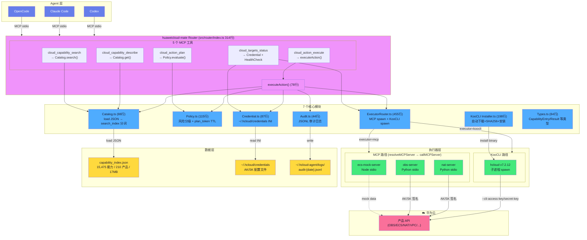
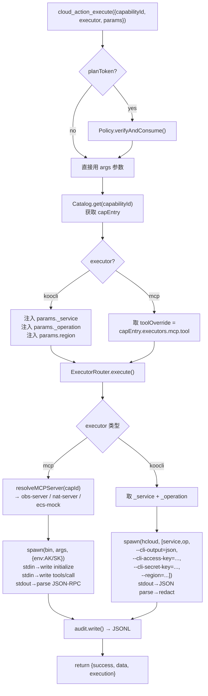
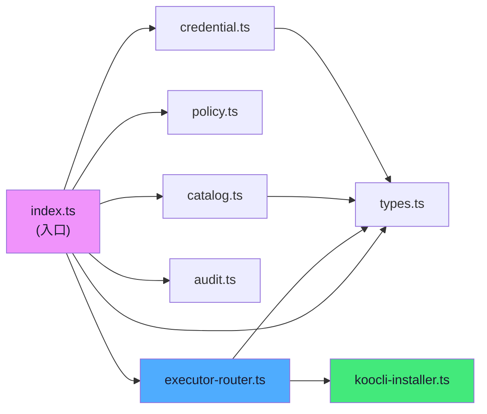
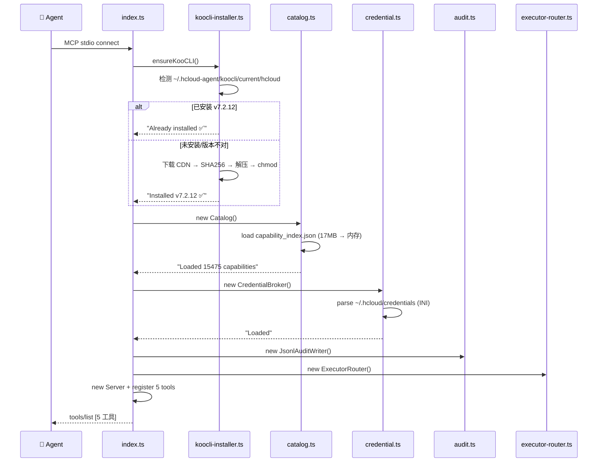

# huaweicloud-mate 插件架构（基于实际代码）

> 来源: `/home/developer/Desktop/huaweicloud-mate/src/router/`  
> 代码: 1,847 行 / 10 个 TS 模块

---

## 总架构



---

## executeAction() 数据流（核心）



---

## 模块依赖关系



---

## 启动流程



---

## 关键代码大小

```
src/router/
├── index.ts              314 行  入口 + 5 工具 + executeAction
├── executor-router.ts    455 行  MCP/KooCLI 双路径 + 健康检查
├── koocli-installer.ts   198 行  KooCLI 自动安装
├── policy.ts             115 行  风险分级 + plan_token
├── catalog.ts             88 行  能力目录 17MB JSON 加载
├── credential.ts          87 行  ~/.hcloud/credentials INI
├── types.ts               84 行  类型定义
├── audit.ts               44 行  JSONL 审计日志
├── mock/ecs-mock-server.ts 130 行  ECS Mock (3 tools)
└──────────────────────────
  总计: 1,847 行
```
