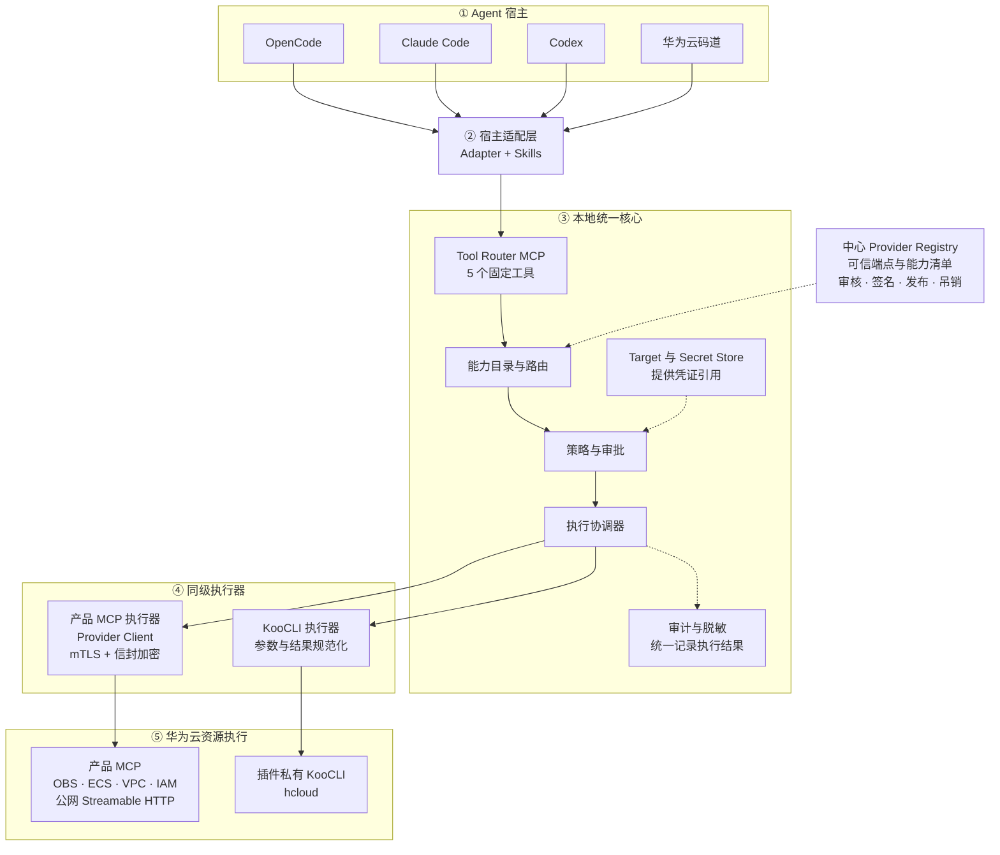
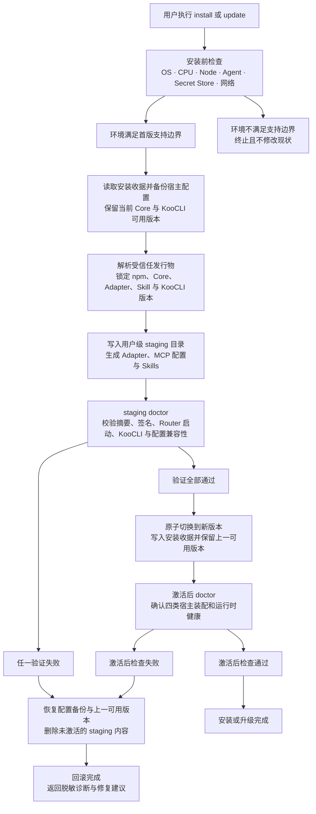
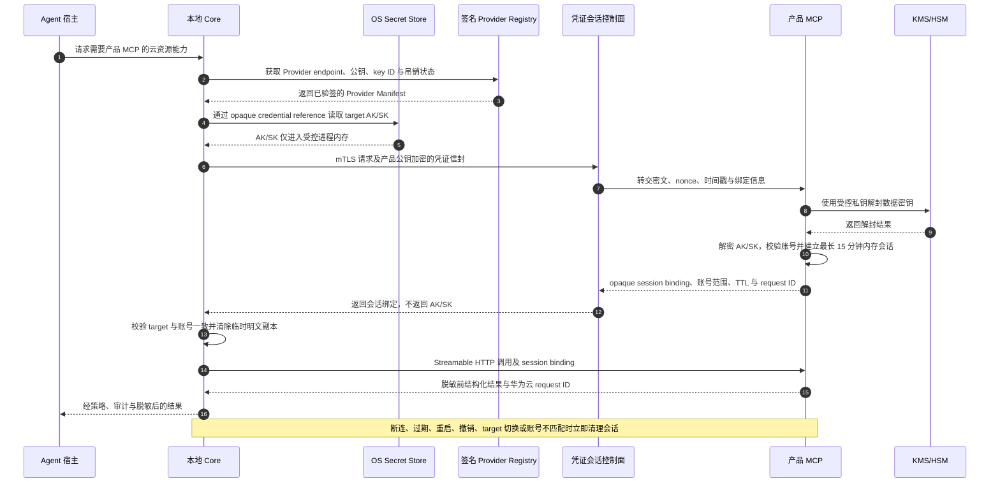

# 华为云 Agent 插件技术架构

状态：Proposed v0.2  
日期：2026-07-13  
当前理解度：约 95%

配套文档：

- [智能体适配器接口规范](智能体适配器接口规范.md)
- [产品 MCP 接入规范](产品MCP接入规范.md)
- [安全架构](安全架构.md)
- [首版实施路线图](首版实施路线图.md)
- [架构决策记录](架构决策/)

## 1. 目标

构建一个可通过类似 npm 命令一键安装的华为云 Agent 插件。插件统一集成：

- 华为云托管的产品 MCP；
- 本地 KooCLI；
- 面向云资源操作的 Agent Skills；
- OpenCode、Claude Code、Codex、华为云码道适配器。

首版支持 Windows amd64、Linux amd64/arm64、macOS amd64/arm64，覆盖 OBS、ECS、VPC、IAM。

## 2. 核心原则

1. **一套 Core，多套薄适配器**：新增 Agent 不复制华为云业务逻辑。
2. **固定小工具面，能力按需展开**：Agent 默认只加载少量 Router tools，不加载所有产品工具 schema。
3. **产品 MCP 与 KooCLI 双执行器**：两者同等进入能力目录，Agent可按场景选择。
4. **策略优先于提示词**：Skill 负责指导，Core 的 Policy Engine 才是最终强制边界。
5. **凭证不进入模型上下文**：AK/SK 不出现在 prompt、Skill、工具参数、工作区、命令行或审计正文。
6. **执行后端一旦确定不得静默切换**：特别是写、删、付费操作，失败后禁止自动换后端重放。
7. **安装和运行分离**：Installer 负责装配、升级和修复；Runtime 负责发现、路由、策略、凭证与执行。

## 3. 总体架构



## 4. 进程与生命周期

### 4.1 安装期

建议的用户入口：

```text
npx @huaweicloud/agent-plugin install
```

插件发布到公共 npm；假定目标机器已安装 Node.js。`@huaweicloud/agent-plugin` 为建议包名，最终以 npm scope 审核结果为准。Installer 默认执行用户级全局装配：

1. 检测 OS、CPU、Node 环境和已安装 Agent；
2. 安装版本锁定的 Core runtime；
3. 从华为云官方地址下载匹配平台的 KooCLI 包和 SHA-256 文件；
4. 校验后安装到插件私有目录，不依赖管理员权限和系统级 PATH；
5. 为检测到的 Agent 安装 adapter、MCP 配置和 Skills；
6. 写入中心 Provider Registry 的地址、信任根和缓存策略；
7. 运行 `doctor` 验证 MCP 启动、KooCLI 版本、Secret Store 和网络连接；
8. 变更宿主配置前备份，失败时原子回滚。

Installer 还应提供：

```text
hcloud-agent install
hcloud-agent update
hcloud-agent uninstall
hcloud-agent doctor
hcloud-agent target add|list|remove
hcloud-agent adapter list|repair
```

安装、升级与失败回滚使用同一条事务式流程：



安装与升级均不得原地覆盖当前可用版本。预检失败时不得修改现状；staging 或激活后 `doctor` 失败时，恢复宿主配置、Core 和 KooCLI 的一致版本组合（首次安装时恢复为未安装状态）。回滚结果也必须再次校验并写入脱敏诊断。

### 4.2 运行期

首版建议每个 Agent session 启动一个本地 stdio Router 进程，而不是安装常驻 daemon：

- 生命周期与 Agent session 一致；
- 避免监听固定本地端口；
- 降低跨用户、跨 workspace 权限隔离复杂度；
- Provider Registry 缓存、KooCLI 和 Secret Store 可由多个进程安全共享。

如后续需要跨 Agent 共享连接池，再演进为受保护的用户级 daemon。

## 5. Tool Router MCP

不直接复用 MetaMCP，只参考 namespace、catalog、middleware。正式工具名避免继续使用语义模糊的 `mcp_provision`。

首版固定工具面建议不超过五个：

| 工具 | 职责 |
|---|---|
| `cloud_capabilities_search` | 按任务、产品、资源、区域搜索能力，只返回轻量摘要、可用执行器和风险级别 |
| `cloud_capability_describe` | 返回一个 capability 的完整输入 schema、约束、风险、执行器与示例 |
| `cloud_targets_status` | 返回 target、凭证、产品 MCP 健康及账号绑定状态，不返回密钥 |
| `cloud_action_plan` | 校验参数并生成固定 target、executor、region/project、风险和幂等信息的短期计划 |
| `cloud_action_execute` | 执行读操作或已确认计划，统一返回结果、有效作用域和审计 ID |

明确不提供：

- 任意 JavaScript/Python 执行型 meta-tool；
- 任意 URL、命令或 MCP endpoint 参数；
- 绕开 catalog 的通用 OpenAPI 调用入口；
- 通过工具参数传入 AK/SK。

## 6. 统一能力目录

### 6.1 Capability 模型

能力是 Agent 选择的基本对象，不等同于某个 MCP tool 或某条 KooCLI 命令：

```yaml
capabilityId: huaweicloud.ecs.server.list.v1
product: ecs
resource: server
action: list
summary: List ECS servers in a project and region
scope:
  account: required
  project: required
  region: required
risk:
  level: read
  sensitiveOutput: true
executors:
  - type: provider-mcp
    providerId: huaweicloud-ecs
    tool: ecs_list_servers
    status: available
  - type: koocli
    service: ECS
    operation: NovaListServersDetails
    status: available
schemaRef: sha256:...
```

一个能力可以有一个或两个执行器。Agent 通过 `describe` 看到各执行器的适用场景：

- 产品 MCP：结构化语义更强、产品错误解释更好、可能支持产品级组合操作；
- KooCLI：OpenAPI 覆盖面广、适合命令/脚本/批量场景、可作为独立选择；
- Core 不把 KooCLI定义成 MCP 的低优先级 fallback。

执行计划创建后必须锁定 executor。写/删操作执行失败时，返回错误并要求用户重新计划，禁止自动切换。

### 6.2 Namespace

建议逻辑 namespace：

```text
huaweicloud/{product}/{provider-version}
huaweicloud/koocli/{koocli-version}
```

namespace 用于版本、健康、策略、区域和租户隔离，不直接成为 Agent 可修改的 endpoint。

## 7. 中心 Provider Registry

注册表按产品 MCP 发布，不按单个用户或单次调用发布。每份清单应签名、可缓存、可吊销：

```yaml
providerId: huaweicloud-ecs
product: ecs
version: 1.0.0
transport:
  type: streamable-http
  endpoint: https://...
  channelAuthProfile: huaweicloud-plugin-mtls-v1
protocol:
  mcpVersion: "..."
  routerContract: 1
credentialModes:
  - sts-session-v1
regions: ["*"]
capabilityIndex:
  url: https://...
  sha256: "..."
riskMetadata: required
auditContract: request-id-v1
owner:
  team: ecs-product-team
registry:
  issuedAt: "..."
  expiresAt: "..."
  keyId: "..."
  signature: "..."
```

Core 必须：

- 只信任内置或企业策略下发的 registry 根；
- 校验签名、有效期、版本兼容性和 capability index 摘要；
- 支持 last-known-good 缓存和 provider 紧急吊销；
- endpoint 只能来自 registry，Agent、Skill 和 workspace 均不能覆盖；
- 对产品 MCP 执行连接健康检查和契约版本检查。

## 8. 双执行器路由

Agent 自行选择不等于无规则选择。所有 adapter 共享同一份 Skills，至少说明：

1. 用户明确要求 MCP 或 KooCLI 时尊重用户选择；
2. 产品语义、复杂校验和产品专属组合操作可选 MCP；
3. 命令、脚本、批量和 OpenAPI 原生参数场景可选 KooCLI；
4. 两个执行器都可用时，`describe` 必须把差异展示给 Agent；
5. 高风险操作在 plan 阶段固定执行器，禁止失败后自动切换；
6. Core 对两种执行器执行相同的 target、policy、redaction 和 audit 规则。

低风险读操作允许 `executor=auto`；Core 根据健康、能力匹配和显式用户偏好选择并记录 executor。写、删、IAM、网络和计费操作不能使用未展示选择结果的自动切换。

## 9. KooCLI 集成

### 9.1 安装

- 跟随官方 KooCLI OS/CPU 支持矩阵；
- 安装时从批准的官方地址下载固定版本，而不是拉取不受控的 `latest`；
- 验证官方 SHA-256；未来如提供代码签名，同时验证签名；
- 采用版本化私有目录并保留上一个可用版本；
- Core 使用绝对路径和参数数组启动，不通过 Shell 字符串拼接；
- 不要求用户手动修改系统 PATH。

### 9.2 调用

KooCLI Adapter 负责：

- 将 capability 参数映射为 KooCLI service/operation 参数；
- 使用结构化 JSON 输入输出；
- 注入 target 对应凭证和 region/project；
- 设置超时、最大输出、重试和取消；
- 清理 AK/SK、SecurityToken、Authorization、签名和敏感响应字段；
- 把 KooCLI 错误规范化为 Core error model。

原生 `hcloud` 默认不加入开发者 PATH，只安装在插件私有目录。Agent 与开发者均通过 `hcloud-agent koocli ...` 或 Router 使用受控执行路径。

## 10. 凭证与 Target

### 10.1 本地存储

```yaml
targetId: production
accountId: verified-account-id
defaultRegion: cn-north-4
defaultProjectId: optional
credentialRef: opaque-secret-store-reference
authMode: aksk
```

- Windows 使用 Credential Manager；
- macOS 使用 Keychain；
- Linux 使用桌面 Secret Service/libsecret；首版不支持没有桌面 Keyring 的 headless Linux；
- 配置文件只保存非敏感 target 元数据和 opaque reference；
- AK/SK 通过交互式安全输入写入 Secret Store，不允许作为 CLI 参数；
- target 模型预留 `securityToken`、Agency、SSO 等未来认证模式。

### 10.2 两层认证

必须区分：

1. **MCP 通道认证**：本地 Core 是否连接到一个受信任的华为云产品 MCP，例如 mTLS/OAuth/企业网关身份；
2. **云资源身份**：产品 MCP 使用哪个用户账号调用 OBS/ECS/VPC/IAM。

首版采用独立凭证控制面委托永久 AK/SK：

1. AK/SK 只保存在本机 OS Secret Store；
2. Core 为设备生成不可导出的本地密钥，并通过华为云 IAM 签名的注册请求引导短期 mTLS 客户端身份；
3. Registry 发布产品 MCP 的 credential control endpoint、公钥和 key ID；
4. Core 使用 mTLS，并以产品公钥进行应用层信封加密后发送 AK/SK；即使 TLS 在网关终止，中间层也不能获得明文；
5. 产品 MCP 只在进程内存中保存凭证，按 provider + device + account 创建不超过 15 分钟的短期会话；
6. 普通 MCP 数据面只携带不透明 session binding，不携带 AK/SK；
7. 断连、过期、target 切换、凭证轮换、服务重启或显式撤销立即清除会话；
8. 产品 MCP 必须返回有效 account/project/region 和 request ID，Core 校验账号一致性。

该方案必须经过平台安全评审与 Provider conformance 测试后才能启用远程资源操作。产品 MCP 尚未就绪或未通过认证时，该产品仍可通过本地 KooCLI 覆盖。

凭证会话与普通 MCP 数据面分离，完整时序如下：



凭证信封只允许发送到 Registry 签名绑定的目标 Provider。第三方 MCP 不得接入该控制面；普通 MCP 请求只携带不透明 session binding。

## 11. Policy、确认与审计

建议统一风险级别：

| 级别 | 示例 | 默认策略 |
|---|---|---|
| `read` | 查询资源、状态、列表 | 允许；敏感输出仍脱敏 |
| `write` | 创建、修改标签或配置 | 生成 plan，按用户/企业策略确认 |
| `destructive` | 删除、解绑、停止关键资源 | 每次显式确认，短期 plan token |
| `privileged` | IAM、权限、密钥、网络暴露 | 每次确认，可由企业策略直接禁止 |
| `cost` | 创建计费资源、扩容 | 展示成本相关摘要并确认 |

每次执行记录：

- correlation ID、Agent、adapter、插件版本；
- target/account 的不可逆摘要；
- product、capability、executor、provider/KooCLI 版本；
- region/project、风险级别、审批结果；
- 参数与结果的脱敏摘要；
- 华为云 request ID、耗时和错误分类。

审计中不得记录 AK/SK、SecurityToken、Authorization、完整签名或敏感响应正文。

## 12. Agent Adapter SPI

Adapter 只实现宿主差异：

```ts
interface AgentAdapter {
  id: "codex" | "claude" | "opencode" | "codearts" | string;
  detect(): Promise<DetectionResult>;
  capabilities(): AgentHostCapabilities;
  install(input: InstallContext): Promise<InstallReceipt>;
  verify(): Promise<VerificationResult>;
  uninstall(receipt: InstallReceipt): Promise<void>;
}
```

首版能力标记至少包括：

```text
mcp.localStdio
mcp.remoteHttp
skills.agentSkills
plugin.nativeBundle
config.userScope
config.projectScope
approval.nativeMapping
```

Adapter 安装内容：

- Codex：Codex plugin manifest、Router MCP 配置、Skills；
- Claude Code：自包含 Claude plugin、Router MCP 配置、Skills；
- OpenCode：用户级 MCP/plugin 配置、Skills；
- 码道：CLI/桌面支持的 MCP、Skills 和可选 plugin hooks 配置。

Core 不读取宿主私有会话内容，也不依赖某个宿主的 Hook 才能保证安全。

## 13. 推荐工程结构

```text
Cloud-Meta-Plugin/
  packages/
    installer/
    cli/
    core/
    router-mcp/
    capability-catalog/
    policy-engine/
    credential-broker/
    provider-client/
    koocli-manager/
    audit/
    adapter-sdk/
    adapters/
      codex/
      claude/
      opencode/
      codearts/
  skills/
    canonical/
  registry-schema/
  provider-conformance/
  docs/
    架构决策/
```

采用 TypeScript monorepo 和官方 MCP SDK，共享 schema 与跨平台 installer；以公共 npm 包发布。`engines` 支持范围在实现阶段按当时仍受支持的 Node LTS 版本锁定，并在 CI 覆盖全部声明版本。

## 14. 首版验收基线

1. 一条安装命令能够检测并装配四类 Agent，支持选择或跳过某个 adapter；
2. 无管理员权限时可安装 Core 与 KooCLI；
3. 四类 Agent 默认只看到固定小工具面；
4. OBS、ECS、VPC、IAM 能力可被搜索和描述；
5. 产品 MCP 与 KooCLI 都能作为显式 executor 被选择；某个产品 MCP 尚未上线时，KooCLI 可以先满足该产品覆盖要求；
6. 写/删/IAM/网络/计费操作经过统一 plan 和确认；
7. 任何副作用操作失败后不自动切换 executor；
8. AK/SK 不出现在 Agent 上下文、工具参数、命令行、工作区或日志扫描结果中；
9. Provider Registry 清单签名、过期、吊销和 last-known-good 行为通过测试；
10. Windows amd64、Linux amd64/arm64、macOS amd64/arm64 完成安装和最小端到端测试。

## 15. 已收敛的发行与环境边界

1. 发布到公共 npm，假定已安装 Node.js；
2. 默认用户级全局安装；
3. 产品 MCP 使用公网 Streamable HTTP endpoint；
4. 不支持无互联网环境，不支持 HTTP/HTTPS 代理；
5. 不支持没有桌面 Keyring 的 headless Linux；
6. 原生 `hcloud` 不进入 PATH；
7. 低风险读操作允许 `executor=auto`，副作用操作锁定 executor；
8. 插件平台团队负责审核、签名、发布和吊销 Provider Manifest；
9. 产品 MCP 未上线时允许由 KooCLI 先满足产品覆盖。

仍需在实施启动前由组织指定具体的 Registry 签名密钥托管、mTLS 证书签发服务、产品 MCP 公钥轮换机制和安全事件响应责任人。这些属于部署绑定，不改变本架构模块边界。

## 参考资料

- [MetaMCP](https://github.com/metatool-ai/metamcp)
- [KooCLI 安装概述](https://support.huaweicloud.com/qs-hcli/hcli_02_003.html)
- [IAM 临时安全凭证](https://support.huaweicloud.com/usermanual-iam5/iam_01_1238.html)
- [IAM OpenAPI 凭证最佳实践](https://support.huaweicloud.com/bestpractice-iam5/iam_05_0113.html)
- [OpenCode MCP](https://opencode.ai/docs/mcp-servers)
- [OpenCode Skills](https://opencode.ai/docs/skills)
- [Claude Code Plugins](https://code.claude.com/docs/en/plugins)
- [Claude Code MCP](https://code.claude.com/docs/en/mcp)
- [华为云码道 MCP](https://support.huaweicloud.com/usermanual-cli/codeartsagent_cli_0013.html)
- [华为云码道 Skills](https://support.huaweicloud.com/usermanual-cli/codeartsagent_cli_0019.html)
