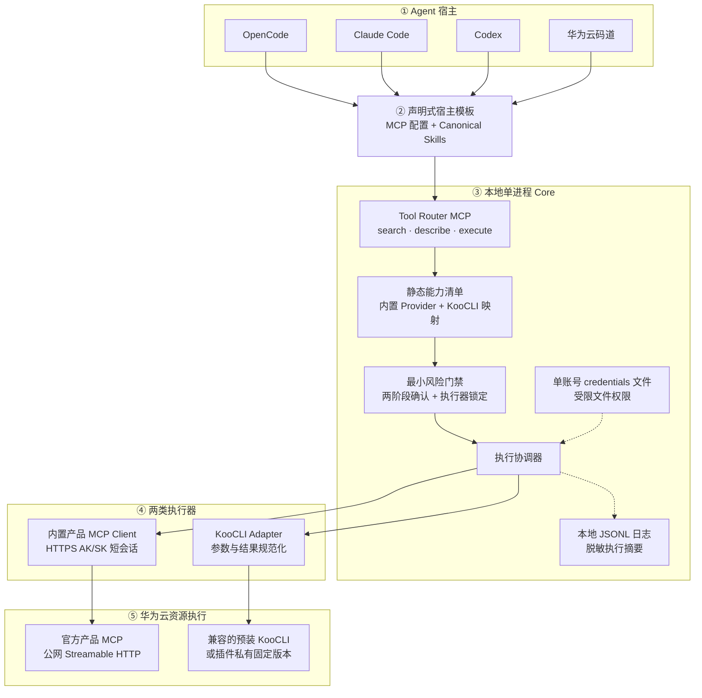
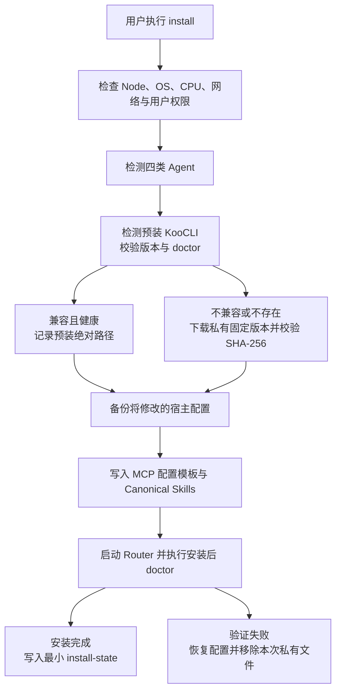
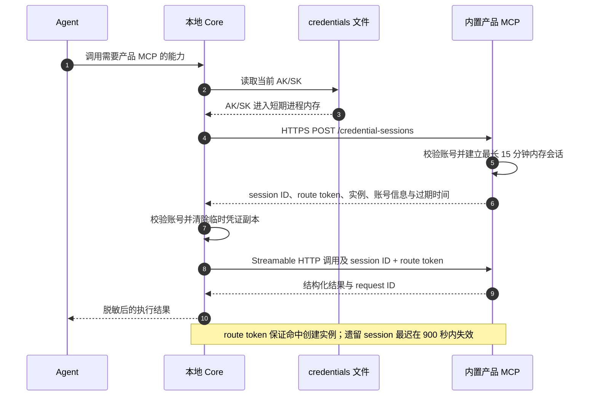

# 华为云 Agent 插件技术架构

状态：Proposed v0.3-lite
日期：2026-07-13<br>
当前理解度：约 93%

配套文档：

- [智能体适配器接口规范](智能体适配器接口规范.md)
- [产品 MCP 接入规范](产品MCP接入规范.md)
- [安全架构](安全架构.md)
- [首版实施路线图](首版实施路线图.md)
- [架构决策记录](架构决策/)

## 1. 目标

通过公共 npm 一键安装，让 OpenCode、Claude Code、Codex 和华为云码道的用户能够直接指挥 Agent 创建、修改、查询和删除华为云资源。

首版统一交付：

- 华为云内置产品 MCP；
- 本地 KooCLI；
- 华为云资源操作 Skills；
- 四类 Agent 的自动配置模板；
- 固定三个工具的本地 Tool Router MCP。

产品 MCP 预计覆盖核心常用云服务；未被产品 MCP 覆盖的能力由 KooCLI 补足。具体首发产品清单在实施前冻结，不改变本架构。

## 2. 精简原则

1. **单一 npm 包**：首版不拆分多 package 控制平面。
2. **固定三个工具**：Agent 只看到 search、describe、execute。
3. **内置 Provider**：产品 MCP endpoint 和元数据随 npm 发版，不建设动态 Registry。
4. **MCP 优先、KooCLI 补位**：产品 MCP 支持且健康时默认使用 MCP，否则在执行前选择 KooCLI。
5. **执行器锁定**：执行开始后不得因为失败、超时或结果未知而自动切换执行器。
6. **最小强制安全边界**：Router 内置复合风险门禁、可信审批凭据、一次性消费、脱敏和超时，不建设独立 Policy Engine。
7. **一个当前账号**：用户首次使用时提供 AK/SK，可覆盖更新；首版不支持多账号 target。
8. **声明式宿主模板**：四宿主共享 Core 和 Skills，不设计通用 Adapter SPI。

## 3. 总体架构



首版 Core 随每个 Agent session 以独立 stdio 进程启动，不安装常驻 daemon。

## 4. 安装与生命周期

建议入口：

```text
npx @huaweicloud/agent-plugin install
```

`npx` 只负责启动安装器。安装器必须把 Router、CLI 和必要资产物化到固定用户目录的版本化运行时，并通过稳定 launcher 或原子 `current` 指针供四宿主长期调用；宿主配置不得引用 npm 临时 cache，Agent session 运行期不得执行 `npx -y`。

首版只提供：

```text
hcloud-agent install
hcloud-agent doctor
hcloud-agent uninstall
hcloud-agent auth set
hcloud-agent auth status
hcloud-agent auth remove
```

重新运行 `hcloud-agent install` 即执行升级检查。首版不提供独立 `update`、`repair` 或复杂 drift 检测。

安装流程：



安装器必须：

- 自动配置检测到的四类 Agent；
- 保留用户未知配置字段；
- 修改前创建备份；
- 只删除 install-state 证明由本插件创建的文件或配置项；
- 首次安装失败时恢复为未安装状态；
- 不使用隐式 npm `postinstall` 修改宿主。

## 5. Tool Router MCP

首版固定暴露三个工具：

| 工具 | 职责 |
|---|---|
| `cloud_capabilities_search` | 按自然语言、产品、资源或动作搜索能力，返回轻量摘要、风险和可用执行器 |
| `cloud_capability_describe` | 返回完整输入 schema、作用域、风险、默认执行器和示例 |
| `cloud_action_execute` | 执行读操作，或完成危险操作的预览、确认和执行 |

明确不提供：

- `cloud_targets_status`：改由 `auth status` 和 `doctor` 承担；
- 独立 `cloud_action_plan`：合并进 `execute` 的两阶段协议；
- 任意 JavaScript/Python 执行能力；
- 允许 Agent 传入任意 endpoint、命令、可执行路径或 AK/SK 的参数；
- 绕过内置能力清单的通用 OpenAPI 入口。

### 5.1 execute 两阶段协议

只有 `operationKind=read`、`riskTags=[]` 且 `confirmationRequired=false` 的普通读取能力可以在校验参数、作用域和执行器后直接执行。

所有 write、复合风险和敏感读取能力首次调用返回：

```json
{
  "schemaVersion": "huaweicloud-agent-approval-request/v1",
  "status": "confirmation_required",
  "previewId": "opaque-preview-id",
  "challenge": "opaque-approval-challenge",
  "parameterDigest": "sha256:...",
  "summary": {
    "capabilityId": "huaweicloud.ecs.server.create.v1",
    "executor": "provider-mcp",
    "operationKind": "write",
    "riskTags": ["cost", "privileged"],
    "scope": {"region": "cn-north-4", "project": "..."},
    "resources": ["ECS server"],
    "effects": ["创建计费实例", "允许公网访问"]
  },
  "allowedIssuerIds": ["host.trusted-approval"],
  "expiresAt": "..."
}
```

Agent 必须把摘要展示给用户。只有固定受信审批签发器观察到明确用户审批后，才能生成 `approvalReceipt`；Agent、Prompt、Skill 和普通 Tool 参数不能自行签发。第二次 `execute` 必须同时携带 `previewId` 和 receipt。

- receipt 绑定 challenge、参数摘要、执行器、账号凭证代次、region/project 和过期时间；
- Router 在 dispatch 前把 `previewId` 从 `pending` 原子转换为 `consumed`；
- 任一绑定字段变化、进程重启或 receipt 过期时失效；
- 失败、超时或 `OUTCOME_UNKNOWN` 后不得复用 preview/receipt；
- receipt 不包含 AK/SK、session ID、route token 或可逆敏感数据。

完整 schema 见 [M0 契约索引](契约/README.md)。

## 6. 静态能力清单

Provider 和 KooCLI capability 映射随 npm 包发布。最小模型：

```yaml
capabilityId: huaweicloud.ecs.server.create.v1
product: ecs
summary: Create an ECS server
inputSchema: {}
outputSchema: {}
scope:
  region: required
  project: required
operationKind: write
riskTags: [cost, privileged]
confirmationRequired: true
executors:
  providerMcp:
    providerId: huaweicloud-ecs
    tool: ecs_create_server
    inputSchemaDigest: sha256:...
  koocli:
    service: ECS
    operation: CreateServers
defaultExecutor: provider-mcp
outputPolicy:
  sensitivePaths: [/adminPass]
  maxBytes: 262144
  allowProviderText: false
```

内置 Provider descriptor 只包含运行必需信息：

```yaml
schemaVersion: huaweicloud-agent-provider/v1-lite
providerId: huaweicloud-ecs
product: ecs
expectedProviderVersionRange: ^1.0.0
dataPlane:
  transport: streamable-http
  endpoint: https://example.huaweicloud.com/mcp
credentialSession:
  endpoint: https://example.huaweicloud.com/credential-sessions
  protocol: huaweicloud-credential-session/v1
  maxTtlSeconds: 900
  routing: opaque-route-token
health:
  endpoint: https://example.huaweicloud.com/health
capabilities:
  path: capabilities/ecs.json
  digest: sha256:...
compatibility:
  providerContractVersion: huaweicloud-agent-provider-contract/v1-lite
  credentialSessionProtocol: huaweicloud-credential-session/v1
  toolSchemaDigest: sha256:...
```

约束：

- endpoint 必须随包内置，Agent、Skill、workspace 和工具参数不能覆盖；
- credential session endpoint 必须与 data plane 同源；
- health endpoint 必须同源，并返回 Provider contract、版本、capability digest 和 tool schema digest；
- 任一握手值与内置 descriptor 不兼容时 fail closed；
- 新增或修改 Provider 必须发布新的 npm 版本；
- 首版不支持社区 Provider、本地自定义 endpoint、动态 Registry、签名、吊销或远程 denylist。

## 7. 执行器选择

选择顺序：

1. `executorPreference` 只作为不可信偏好；Router 在 capability 允许、执行器健康且固定规则通过时采用，并在危险操作摘要与 receipt 中绑定；
2. 未指定时，产品 MCP 声明支持且执行前健康检查通过，则选择产品 MCP；
3. 产品 MCP 未覆盖或执行前不可用，则选择 KooCLI；
4. 生成 preview 或开始执行后锁定 executor；
5. 执行失败、超时或返回 `OUTCOME_UNKNOWN` 时，不自动切换执行器。

切换规则只发生在执行前。副作用动作如需更换执行器，必须重新发起 `execute` 预览并重新确认。

## 8. KooCLI

### 8.1 发现与安装

Installer 先检测用户预装的 `hcloud`：

- 版本位于插件声明的兼容范围且 `doctor` 通过时复用；
- 不兼容、不可用或不存在时，从批准的官方 HTTPS 地址下载插件声明的固定版本；
- 校验官方 SHA-256 后安装到用户级私有目录；
- 不修改用户的系统 KooCLI，不加入系统 PATH；
- 固定版本不代表永久可用，安装完成必须执行版本、网络、认证和最小只读 smoke test。

### 8.2 受控调用

KooCLI Adapter：

- 只允许能力清单内的 service/operation；
- 使用绝对路径和参数数组启动，禁止 Shell 字符串拼接；
- 通过受控进程环境注入当前 AK/SK，不放入命令行；
- 规范化 JSON 结果和错误；
- 设置超时、取消和输出大小上限；
- 清理 Authorization、签名、AK/SK 和敏感响应字段。

## 9. 凭证

### 9.1 本地文件

首版只支持一个当前账号。AK/SK 通过不回显的交互式 `auth set` 输入，禁止 `--ak`、`--sk` 参数。

建议位置：

- Windows：`%APPDATA%\hcloud-agent\credentials.json`；
- macOS：`~/Library/Application Support/hcloud-agent/credentials.json`；
- Linux：`~/.config/hcloud-agent/credentials.json`。

`credentials.json` 与普通 `config.json` 分离：

```json
{
  "schemaVersion": 1,
  "generation": "uuid",
  "accessKey": "...",
  "secretKey": "...",
  "accountIdentity": {"accountId": "...", "domainId": "..."},
  "updatedAt": "..."
}
```

安全约束：

- Linux/macOS 文件权限为 `0600`；
- Windows ACL 仅允许当前用户；
- 禁止位于 workspace、项目目录或可同步目录；
- 日志、错误、doctor 和 install-state 永不输出凭证；
- `auth set` 必须通过 M0 绑定的固定只读身份校验能力获得账号身份，再原子写入凭证和非敏感 identity；
- `auth set/remove` 对当前进程已知 session 尽力立即撤销；
- 其他 Core 在执行前发现凭证代次变化或文件删除后停止复用旧 session；
- 无共享控制面时不承诺全部远程 session 立即撤销，遗留 session 最迟在 900 秒 TTL 或 Provider 重启时失效。

该文件是受权限保护的明文凭证文件，不等同于加密 Secret Store。这是开源精简首版明确接受的安全取舍。

### 9.2 产品 MCP 短会话

产品 MCP 在同域 HTTPS endpoint 接收一次 AK/SK：



首版不使用独立凭证控制面、设备 mTLS、应用层信封加密、KMS/HSM 或多账号绑定。信任边界是：内置官方产品 MCP 可以在进程内存中接触用户明文 AK/SK。

## 10. 最小风险门禁与日志

风险模型：

| 维度 | 值或示例 | Router 行为 |
|---|---|---|
| `operationKind` | `read` / `write` | 所有 write 要求可信审批 |
| `riskTags` | `destructive` | 突出展示删除、解绑、停止等影响 |
| `riskTags` | `privileged` | 展示 IAM、权限或网络暴露范围 |
| `riskTags` | `cost` | 展示计费资源、规格和扩容影响 |
| `riskTags` | `sensitive-read` | 读取敏感数据前要求可信审批 |

只有 `read` 且无风险标签的能力可直接执行。未知、缺失或不一致的风险元数据一律 fail closed。

首版不建设通用 Policy Engine 或企业策略中心。Router 只实现固定风险规则。

本地 JSONL 日志记录：

- correlation ID、Agent、插件版本；
- capability、executor、产品/版本；
- region/project、风险和确认结果；
- 参数与结果的脱敏摘要；
- 产品 MCP 或 KooCLI request ID、耗时和错误分类。

不上传遥测，不记录 AK/SK、session ID 明文、Authorization、完整签名或敏感响应正文。

## 11. 四宿主声明式模板

四类宿主共用一份 Router 启动定义和 Canonical Skills。模板只描述：

- 宿主检测位置；
- 用户级 MCP 配置位置和合并方式；
- Skills 目标位置；
- 固定受信审批签发器及 verifier key ID；
- 验证命令；
- 卸载时可安全移除的标记。

首版不定义通用 Adapter SPI、capability negotiation、repair 或 drift 框架。宿主原生插件能力只用于包装 MCP 配置和 Skills，不承载云资源业务逻辑。

## 12. 推荐工程结构

```text
huaweicloud-mate/
  src/
    cli/
    installer/
    router/
    catalog/
    executors/
      product-mcp/
      koocli/
    auth/
    risk-gate/
    logging/
  providers/
    providers.json
    capabilities/
  hosts/
    codex/
    claude/
    opencode/
    codearts/
  skills/
    canonical/
  docs/
    架构决策/
```

首版采用单一 TypeScript npm package 和官方 MCP SDK。是否拆分 package 留待规模增长后决定。

## 13. 首版验收基线

1. 一条命令自动检测并配置四类 Agent；
2. 四类 Agent 默认只看到三个固定工具；
3. 用户只需首次输入一次 AK/SK，随后可以覆盖更新或删除；
4. 内置产品 MCP 能通过 HTTPS 短会话执行云资源操作；
5. 产品 MCP 未覆盖的能力能够在执行前选择 KooCLI；
6. 兼容的预装 KooCLI 可复用，不兼容时自动安装并验证私有固定版本；
7. 创建、修改、删除、IAM、网络、计费和敏感读取必须携带可信审批凭据；
8. 确认后执行器锁定，失败或结果未知时不自动切换；
9. AK/SK 不进入 Agent 上下文、工具参数、命令行、workspace 或日志；
10. 安装失败恢复宿主配置，卸载不删除用户未知内容；
11. Windows amd64、Linux amd64/arm64、macOS amd64/arm64 完成最小端到端测试。

## 14. 首版边界

首版不支持：

- 离线环境和企业镜像；
- HTTP/HTTPS 代理；
- 无桌面环境的 headless Linux；
- 多账号 target；
- OS Keyring；
- 社区或自定义 Provider；
- 动态 Registry、签名、吊销和远程 denylist；
- 独立凭证控制面、mTLS、信封加密和 KMS/HSM；
- 企业策略中心、集中审计和遥测；
- 独立 update/repair 与复杂 drift 检测；
- 常驻本地 daemon；
- 任意代码工作流执行器；
- 全量 OpenAPI 直接展开到 Agent 工具面。

## 15. 实施前待绑定输入

以下内容不改变架构。reference provider 和统一受信 companion 已解除本地工程开发阻塞，但真实发布前仍必须明确：

- 公共 npm scope 与发布身份；
- 首发真实产品 MCP 清单和同源 endpoint；
- 每个产品 MCP 的 capability 复合风险、输出策略和 schema digest；
- 统一受信审批 companion 的实现验证、私钥保护和责任人；
- KooCLI 兼容版本范围、固定版本和 SHA-256 清单；
- 3～5 个端到端验收场景；
- 产品 MCP 对 credentials session 的实现责任人和安全承诺。
- `auth set` 使用的固定只读账号身份校验能力及责任人。

开发阶段 reference provider 只用于契约和集成测试，不接收真实 AK/SK、不访问云资源，也不进入正式 Provider 清单。四宿主固定绑定 `huaweicloud-mate.local-approval` companion；详细边界见 [ADR-0009](架构决策/0009-参考Provider与统一受信审批Companion.md)。

## 参考资料

- [MetaMCP](https://github.com/metatool-ai/metamcp)
- [KooCLI 安装概述](https://support.huaweicloud.com/qs-hcli/hcli_02_003.html)
- [OpenCode MCP](https://opencode.ai/docs/mcp-servers)
- [OpenCode Skills](https://opencode.ai/docs/skills)
- [Claude Code Plugins](https://code.claude.com/docs/en/plugins)
- [Claude Code MCP](https://code.claude.com/docs/en/mcp)
- [华为云码道 MCP](https://support.huaweicloud.com/usermanual-cli/codeartsagent_cli_0013.html)
- [华为云码道 Skills](https://support.huaweicloud.com/usermanual-cli/codeartsagent_cli_0019.html)
